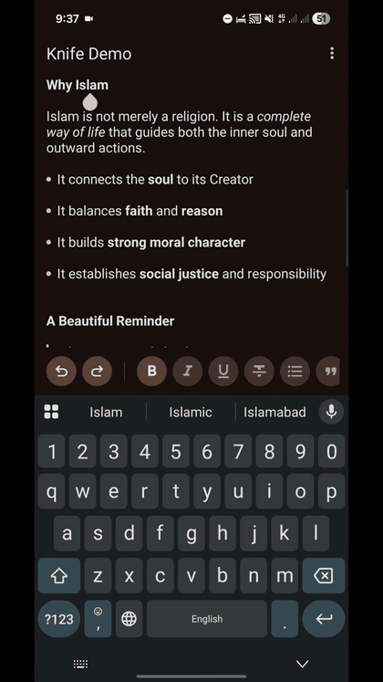

# Knife

## ✨ Knife Editor – Change Log

- 🚀 Migrated project to **Gradle 9**
- 🔧 Updated Android Gradle Plugin and dependencies
- 🎨 Migrated UI to **Material Design 3**
- 🧩 Replaced legacy views with modern Material components
- 🌗 Improved light and dark theme consistency
- 🛠 Redesigned formatting toolbar using Material 3 spacing rules
- 🔁 Moved Undo and Redo to bottom tools bar
- 🔄 Fixed source / code toggle to switch both ways correctly
- ⚠️ Added confirmation dialog before clearing formatting
- 🎯 Centralized editor styling using `KnifeText` attributes
- 🎨 Applied Material 3 semantic colors instead of hardcoded values
- ✍️ Improved bullets, quotes, and link styling
- ♿ Added tooltips and content descriptions for accessibility
- 👆 Improved touch targets for better usability
- 🧯 Fixed crashes related to editor initialization
- 🧠 Fixed text selection and ActionMode conflicts
- 🔁 Improved undo / redo stability
- 🧹 Cleaned and organized codebase
- 🗑 Removed unused logic and hardcoded strings

---

Knife (extends EditText) is a lightweight rich text editor component for writing styled documents in Android.

Just select text and apply formatting with a single line of code.

Supports Android 4.0+

---

## 📸 Example

Download the [demo APK](https://github.com/ameermuawiya/Knife-Modren/releases/download/2.0.0/app-debug.apk)  
Explore the [source code](https://github.com/ameermuawiya/Knife-Modren/tree/master/app)

More experiments: [mthli/Type](https://github.com/mthli/Type)

---

## 🧠 API

- `bold(boolean valid)` → Apply bold
- `italic(boolean valid)` → Apply italic
- `underline(boolean valid)` → Apply underline
- `strikethrough(boolean valid)` → Apply strikethrough
- `bullet(boolean valid)` → Apply bullet list
- `quote(boolean valid)` → Apply quote block
- `link(String link)` → Apply link to selection
- `link(String link, int start, int end)` → Apply link to range
- `contains(int FORMAT)` → Check if selection contains format
- `clearFormats()` → Remove all formatting
- `undo()` → Undo last change
- `redo()` → Redo change
- `fromHtml()` → Import from HTML
- `toHtml()` → Export to HTML

Extend `KnifeText` for deeper control.

---

## 🎛 Custom Attributes

- `app:bulletColor`
- `app:bulletRadius`
- `app:bulletGapWidth`
- `app:historyEnable`
- `app:historySize`
- `app:linkColor`
- `app:linkUnderline`
- `app:quoteColor`
- `app:quoteStripeWidth`
- `app:quoteGapWidth`

---

## 📦 Gradle Setup

Add JitPack repository:

    dependencyResolutionManagement {
        repositories {
            maven { url = uri("https://jitpack.io") }
        }
    }

Add dependency:

    dependencies {
        implementation("com.github.mthli:Knife:v1.1")
    }

---

## 📚 References

- Spans, a Powerful Concept  
  http://flavienlaurent.com/blog/2014/01/31/spans/

- Spanned | Android Developers  
  http://developer.android.com/reference/android/text/Spanned.html

- Html.java Source  
  https://android.googlesource.com/platform/frameworks/base/+/master/core/java/android/text/Html.java

---

## 🙏 Thanks

- https://github.com/neilj/Squire
- https://github.com/SufficientlySecure/html-textview

---

## 📜 License

Copyright 2015 Matthew Lee

Licensed under the Apache License, Version 2.0  
http://www.apache.org/licenses/LICENSE-2.0

Distributed on an "AS IS" BASIS, without warranties or conditions of any kind.
